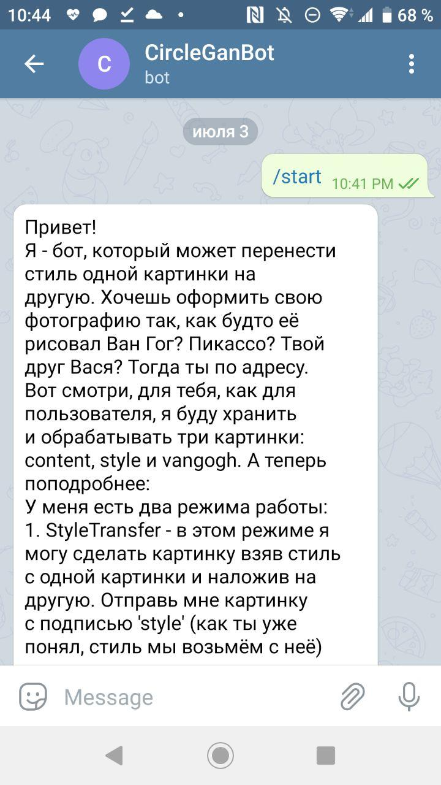
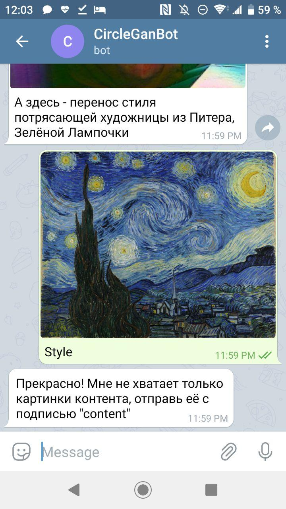
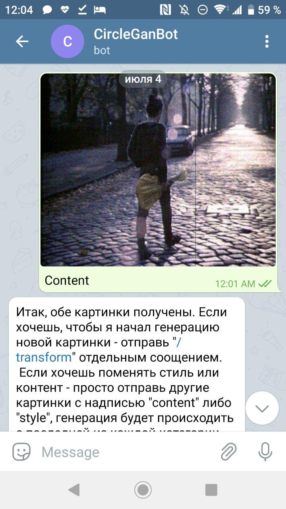
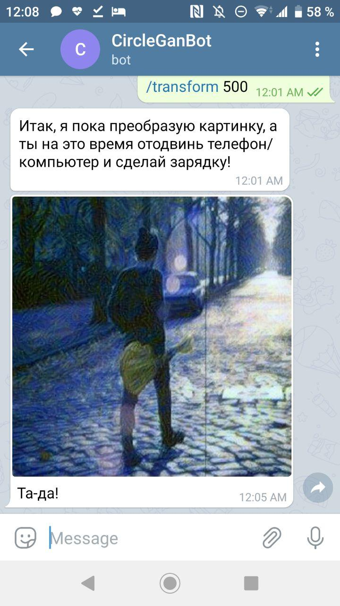
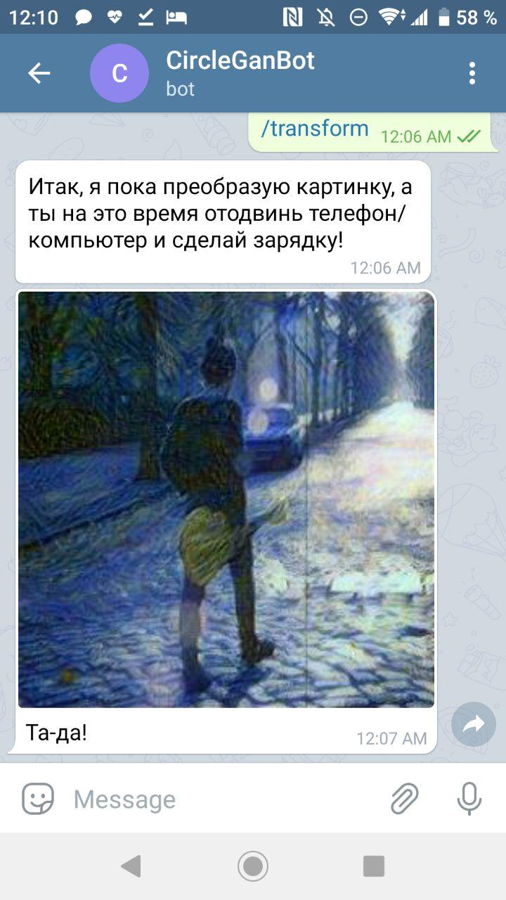
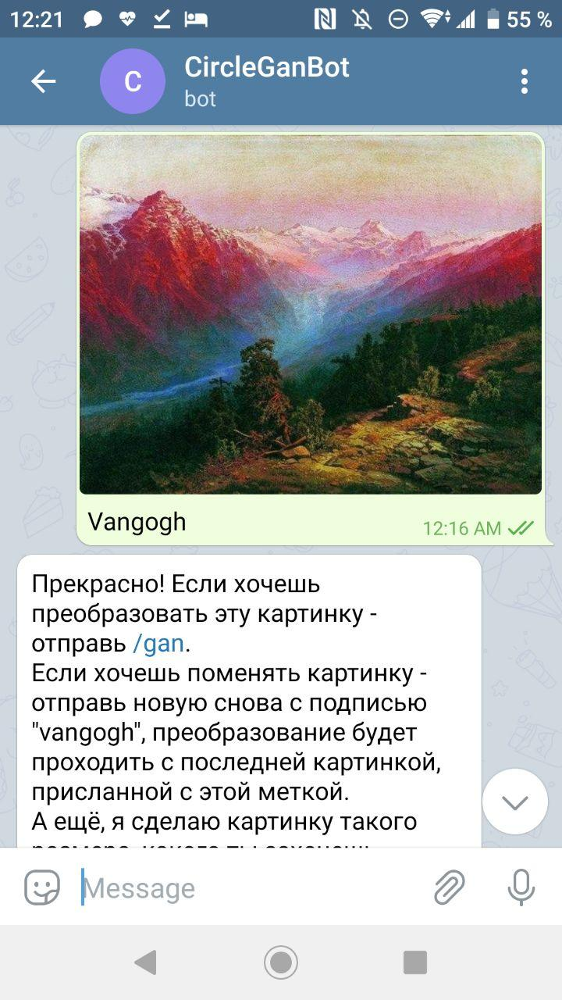
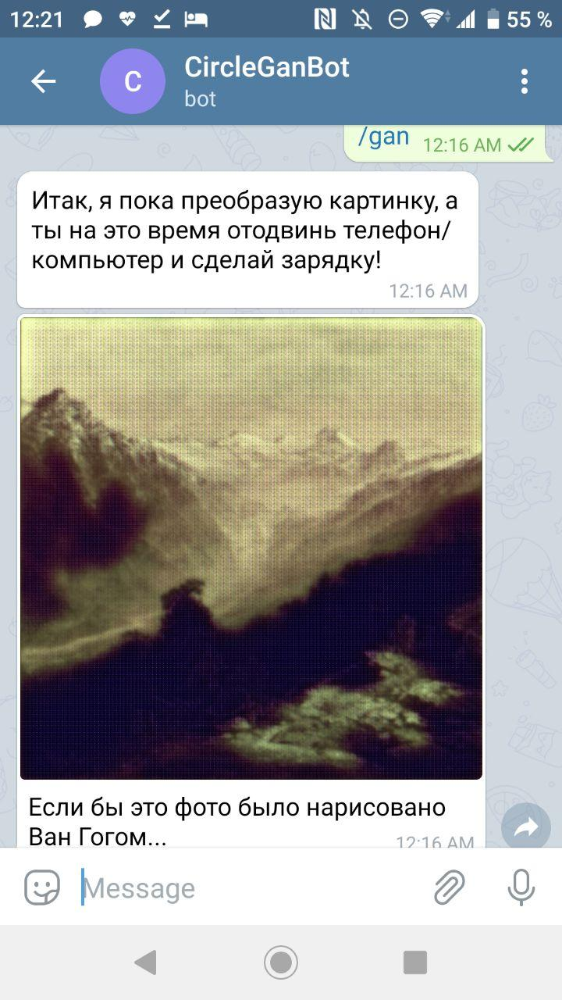

# genganbot_aiogram
Итак, это - бот, позволяющий преображать ваши изображения. Он использует для работы сети Neuro Style Transfer и CycleGAN, соответственно, и режима тоже два.
Для каждого пользователя в мини базе данных будут храниться три картинки: style, content, vangogh. 
Как уже указано выше, у бота есть два режима:
1. StyleTransfer - в этом режиме можно создать изображение, взяв стиль с одной картинки и наложив на другую. 
Отправь картинку с подписью 'style' (стиль мы возьмём с неё)
и другую картинку с подписью 'content' (именно её мы и будем перерисовывать). Потом отправь '/transform', немного подожди и 
наслаждайся результатом!"
2. CycleGAN - в этом режиме я могу превратить любую твою картинку в картину Ван Гога. 
Сеть я писала и тренировала сама, поэтому результаты далеки от идеальных в силу слабого железа. Чтобы опробовать этот режим - 
отправь мне картинку с подписью 'vangogh' (преобразуем мы именно её). Потом отправь команду '/gan' и подожди некоторое время. (Но предупреждаю: результаты там очень не очень)

P.S.: Даже ботам иногда нужен отдых, иначе восстание машин неминуемо. Пока бот работает на моём сервере, поэтому иногда ему нужен перерыв. Но с 8:00 МСК 
до 20:00 МСК всегда можете его проверить.

Ссылка на бота: [бот](t.me/circle_gen_bot)

Примеры общения с ботом:

 

